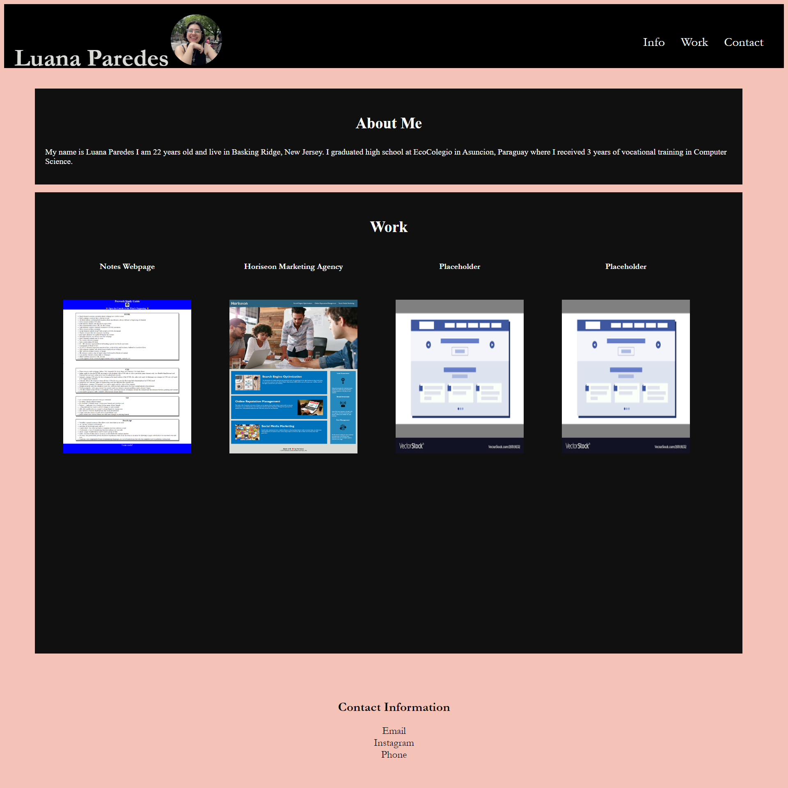

# Module-2-Challenge-Luana

## Description

This webage was the second challenge for Rutgers Bootcamp Module one. Students were tasked with creating a webpage for future employers to be able to learn more about the student and see thier past works. I now have a portfolio to store all of my finished works for future employers. 

## Installation

To install or deploy my portfolio webpage click [this link](https://luanaparedes.github.io/Module-2-Challenge-Luana/)!

## Usage

As mentioned before this webpage is to show my works to future employers. The webpage features images of all on my works and clicking each image takes you to the deployed webpages.

## Credits
(Box-sizing)[https://developer.mozilla.org/en-US/docs/Web/CSS/box-sizing]
(Inline block)[https://stackoverflow.com/questions/4980525/css-center-display-inline-block]
(Flexbox)[https://css-tricks.com/snippets/css/a-guide-to-flexbox/]
(Placeholder images)[https://www.vectorstock.com/royalty-free-vector/website-flat-design-webpage-architecture-vector-20519232]
(Psuedo Classes)[https://developer.mozilla.org/en-US/docs/Web/CSS/Pseudo-classes]

